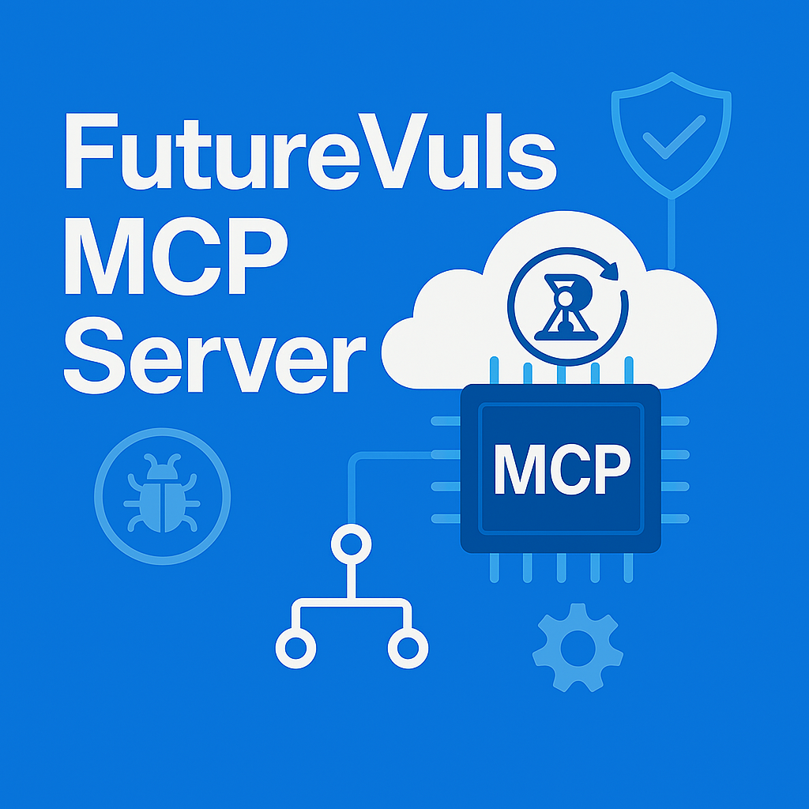

# FutureVuls MCP Server (Windows Edition - Node.js)



**English** | [日本語](README_ja.md)

<div align="center">

**Model Context Protocol (MCP) server for FutureVuls vulnerability management service integration**

</div>

---

## Overview

This project is a Windows-based server that provides access to the FutureVuls API through the Model Context Protocol (MCP). It enables AI assistants like Claude to directly utilize vulnerability management functions.

### 🎯 Key Features

- **🔍 Vulnerability Management**: Search and display detailed CVE information
- **📋 Task Management**: Check and manage vulnerability response tasks
- **🖥️ Server Management**: List and display details of monitored servers
- **📊 Report Generation**: Automated weekly report generation
- **💓 Health Check**: FutureVuls API connection verification

## System Requirements

- **OS**: Windows 10/11 (64bit)
- **Node.js**: 18.0 or higher (LTS recommended)
- **npm**: Included with Node.js
- **Claude Desktop**: Latest version
- **Memory**: 4GB or more recommended
- **Storage**: 1GB or more free space

## Setup

> Note: DXT packaging is not currently supported. We recommend installing and running via npm (global command) for simplicity and reliability.

### 🚀 Quick install (Recommended)

```cmd
npm install -g @keides2/futurevuls-mcp
```

Or if you have a local tarball (offline/distribution):

```cmd
npm install -g .\keides2-futurevuls-mcp-2.1.0.tgz
```

Then you can run the server as a CLI:

```cmd
futurevuls-mcp
```

### 📦 1. Clone the Repository

```cmd
git clone https://github.com/keides2/futurevuls-mcp.git
cd futurevuls-mcp
```

### 🛠️ 2. Automated Setup (Recommended)

```cmd
setup_windows.bat
```

This script automatically performs the following:

- Node.js environment verification
- npm dependency installation
- Configuration file template creation
- Claude Desktop configuration file creation

### ⚙️ 3. Manual Setup

#### Install Node.js Dependencies

```cmd
npm install
```

#### Create Configuration Files

```bash
copy .env.sample .env
copy groups.json.template groups.json

# Be careful not to overwrite when using other MCPs
copy claude_desktop_config.json.template "%APPDATA%\Claude\claude_desktop_config.json"
```

### 🔧 4. Edit Configuration Files

#### Configure .env File

Open the `.env` file with Notepad or VS Code and configure the following:

```bash
# FutureVuls API Configuration (Required)
FUTUREVULS_API_TOKEN=your_actual_api_token_here

# Debug Mode (Optional)
FUTUREVULS_DEBUG=false
```

#### Configure groups.json File

The `groups.json` file can be placed in any of the following locations (**in priority order**):

1. **Current Directory** - The directory where the command is executed (most convenient)
2. **Script Directory** - The directory where `futurevuls-mcp.js` is located
3. **Home Directory** - `C:\Users\[USERNAME]\groups.json`

Create/edit the `groups.json` file with Notepad or VS Code and set your actual group information in the following format:

```json
Group Name: [
  "Group Token",
  "Group ID",
  "Number of Vulnerabilities"
]
```

**Example:**

```json
{
    "group": [
        {
            "Production Environment": [
                "fvgs-xxxxxxxx-xxxx-xxxx-xxxx-xxxxxxxxxxxx",
                123,
                1500
            ]
        },
        {
            "Development Environment": [
                "fvgs-yyyyyyyy-yyyy-yyyy-yyyy-yyyyyyyyyyyy", 
                456,
                800
            ]
        },
        {
          ...
        }
    ]
}
```

> **💡 Tip**: For npm global installations, placing `groups.json` in Claude Desktop's working directory (typically `C:\Users\[USERNAME]`) is the easiest approach.

### 🤖 5. Claude Desktop Configuration

#### Configuration File Location

```bash
%APPDATA%\Claude\claude_desktop_config.json
```

**Access via File Explorer:**

1. Press `Win + R` keys
2. Type `%APPDATA%\Claude` and press Enter
3. Edit `claude_desktop_config.json`

#### Configuration Method (Using Template)

**Method 1: Copy Template (Recommended)**

```bash
# Be careful not to overwrite when using other MCPs
copy claude_desktop_config.json.template "%APPDATA%\Claude\claude_desktop_config.json"
```

**Method 2: Manual File Creation**
Create `%APPDATA%\Claude\claude_desktop_config.json` using Notepad or VS Code

#### Edit Configuration Content

Preferred (npm global command):

```json
{
  "mcpServers": {
    "futurevuls": {
      "command": "futurevuls-mcp",
      "args": [],
      "env": {
        "FUTUREVULS_API_TOKEN": "your_actual_api_token_here"
      }
    }
  }
}
```

Alternative (direct Node path, if not using global install):

```json
{
  "mcpServers": {
    "futurevuls": {
      "command": "node",
      "args": ["C:\\Users\\[USERNAME]\\path\\to\\futurevuls-mcp\\futurevuls-mcp.js"],
      "env": {
        "FUTUREVULS_API_TOKEN": "your_actual_api_token_here"
      }
    }
  }
}
```

**⚠️ Important Notes for Path Specification:**

- Use **absolute paths**
- Escape backslashes with `\\` (use `\\` instead of `\`)
- Replace with your actual installation path
- **File name is `futurevuls-mcp.js`** (not Python)
- Avoid paths containing Japanese characters

## Usage and Operation Verification

### 💡 About MCP Server Operation

**AI assistants like Claude Desktop automatically communicate with the MCP server after configuration.** 
The manual startup methods below are primarily for **configuration verification, troubleshooting, and development purposes**.

### 🔍 1. Verification - Start with Batch File

```cmd
start_mcp.bat
```

**Use Cases**:

- Operation verification before Claude Desktop configuration
- Detailed error message confirmation
- Log output monitoring

### 🔍 2. Verification - Run via npm global command

```cmd
futurevuls-mcp
```

### 🔍 3. Verification - Direct Node.js Execution

```cmd
node futurevuls-mcp.js
```

**Use Cases**:

- Detailed debug information confirmation
- npm dependency issue identification
- Development and testing operation verification

### ✅ How to Verify Normal Operation

**1. Manual Startup Verification**
If the following messages appear at startup, it's working normally:

```cmd
FutureVuls MCP Server starting...
Listening on stdio...
Server initialized successfully
```

**2. Claude Desktop Verification**

- Restart Claude Desktop
- Type something like "Check FutureVuls vulnerabilities"
- If MCP tools are recognized and executed, it's successful

## DXT Distribution (currently unsupported) — reasons

At present, distributing/running this server in DXT format is not officially supported due to stability concerns. As a workaround, please use the npm global command (futurevuls-mcp) or run directly with Node.js as described above.

### Symptoms

- In Claude Desktop's UtilityProcess environment, after initialization the following intermittently occur:
  - -32001 Request timed out
  - Unexpected server transport closed
- On the same machine, direct Node execution and Content-Length smoke tests succeed (not reproducible)

### Actions Taken

- Rewrote the JSON-RPC stdin parser to support:
  - Content-Length framing (LSP-style) and JSON Lines
  - Flexible header termination detection (CRLFCRLF/LFLF)
  - Response framing that matches the input style
- Simplified initialize response and metadata, bumped versions, and repackaged multiple times
- Reinstalled DXT package, changed install locations (different drive/ASCII-only paths), re-enabled extensions, etc.
- Timeouts/closures still persisted only on some environments

### Current Assessment

We suspect environment-specific behavior related to UtilityProcess stdio/lifecycle in certain setups, which prevents us from guaranteeing stability via DXT. In contrast, the npm global command approach has been stable and is operationally simple, so we recommend it as the official method.

### Policy

- Officially supported: npm global command (futurevuls-mcp)
- Alternative: direct Node execution (for development/verification)
- DXT: will be revisited as upstream behavior improves; any progress will be announced in README/release notes

## API Function List

| Function | Description | Claude Usage Example |
|----------|-------------|---------------------|
| `futurevuls_health_check` | API health check | "Check FutureVuls connection status" |
| `futurevuls_list_groups` | Get group list | "Show me monitored groups" |
| `futurevuls_get_cves` | Get CVE list | "Display latest vulnerability list" |
| `futurevuls_get_cve_detail` | Get CVE details | "Tell me details of CVE-2023-12345" |
| `futurevuls_get_tasks` | Get task list | "Are there any tasks to handle?" |
| `futurevuls_get_task_detail` | Get task details | "Check details of task 123" |
| `futurevuls_get_servers` | Get server list | "Show list of monitored servers" |
| `futurevuls_get_groupset_servers` | Get groupset servers | "Show servers in groupset" |
| `futurevuls_get_group_members` | Get group members | "Show members of group 123" |
| `futurevuls_get_org_groups` | Get organization groups | "List all organization groups" |
| `futurevuls_get_org_members` | Get organization members | "Show organization members" |
| `futurevuls_search_critical_cves` | Search high-severity CVEs | "Extract CRITICAL vulnerabilities" |
| `futurevuls_generate_weekly_report` | Generate weekly report | "Generate this week's vulnerability report" |

## File Structure

```text
futurevuls-mcp/
├── 📄 futurevuls-mcp.js           # Main MCP Server (Node.js) - For Claude Desktop
├── 📄 futurevuls-mcp-legacy.js    # Legacy MCP Server (Node.js) - For VSCode + Cline
├── 📦 package.json                # Node.js dependencies and metadata
├── 🚀 start_mcp.bat               # Windows startup script
├── ⚙️ setup_windows.bat           # Windows setup script
├── 🔧 .env.sample                 # Environment variable template
├── 📊 groups.json.template        # Group configuration template
├── 🤖 claude_desktop_config.json.template # Claude Desktop configuration template
├── 📖 README.md                   # This file
├── 📜 LICENSE                     # License
├── 📁 docs/                       # Documentation
├── 🖼️ img/                        # Top and logo image files
└── 📁 evac/                       # Development, test, and Python version files
```

### 🔧 About Server Files

**futurevuls-mcp.js** (Main)

- For Claude Desktop use
- Latest MCP protocol version (2025-06-18)
- Recommended for general use

**futurevuls-mcp-legacy.js** (Legacy)  

- For VSCode + Cline use
- Legacy MCP protocol version (2024-11-05)
- Use when the main version is incompatible

## Security Considerations

⚠️ **Important**: The following files contain sensitive information and should not be shared with third parties:

- `.env` (environment variables and API tokens)
- `groups.json` (actual group configuration)
- `claude_desktop_config.json` (actual Claude Desktop configuration)

---

## Note

This project is designed for use with Node.js on Windows environments.

---
2025/07/29 keides2 Node.js version support
