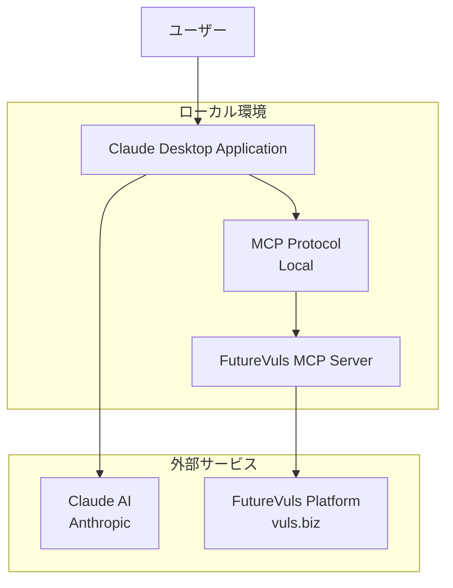
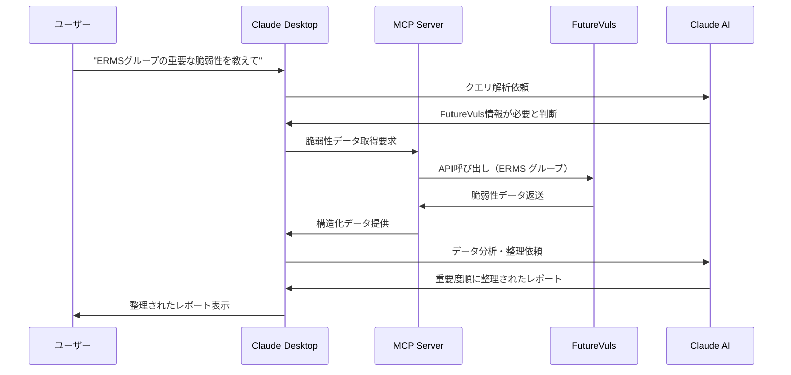

# FutureVuls MCP サーバー利用手順書

## 目次

1. [利用目的・効果・メリット](#利用目的効果メリット)
2. [利用対象者](#利用対象者)
3. [システム概要](#システム概要)
4. [前提条件とリスク説明](#前提条件とリスク説明)
5. [インストール手順](#インストール手順)
6. [利用可能な機能](#利用可能な機能)
7. [セキュリティ設定とベストプラクティス](#セキュリティ設定とベストプラクティス)
8. [トラブルシューティング](#トラブルシューティング)
9. [利用停止・削除手順](#利用停止削除手順)

---

## 利用目的・効果・メリット

### 🎯 導入目的

**FutureVuls MCP サーバー**は、AI支援による効率的なセキュリティ運用を実現するツールです。Claude DesktopとFutureVulsを連携することで、従来の手動作業を大幅に効率化し、セキュリティ担当者の生産性向上を図ります。

### 📈 期待される効果

#### 1. **作業効率の向上**
- **脆弱性レポート作成の大幅な効率化**: 週次・月次レポートの作成時間を大幅削減
- **自然言語での脆弱性検索**: 「CVSS 9.0以上で今週発見された脆弱性を教えて」など直感的な操作
- **複数データソースの統合分析**: CVE情報、タスク状況、サーバー情報を一括で確認
- **リアルタイム問い合わせ**: 従来の週に一度のスクリプトを使った固定書式レポートから、リアルタイムに自由な問い合わせができるようになった

#### 2. **ヒューマンエラーの削減**
- **一貫性のあるレポート生成**: AIによる標準化されたフォーマット
- **見落とし防止**: 重要度の高い脆弱性の自動抽出・優先度付け
- **作業ログの自動記録**: 操作履歴と判断根拠の明確化

#### 3. **意思決定の迅速化**
- **リアルタイム分析**: 最新の脆弱性情報に基づく即座の状況把握
- **トレンド分析**: 過去データとの比較による傾向分析
- **優先度の可視化**: CVSS スコアや影響範囲に基づく自動優先順位付け

### 💡 具体的なメリット

#### **日常業務での活用例**

1. **週次セキュリティ会議の準備**
   ```
   「ERMS グループの今週発見された Critical レベルの脆弱性をまとめて」
   → 自動で該当CVEを抽出し、影響範囲と対応状況を整理
   ```

2. **緊急対応の判断支援**
   ```
   「CVE-2024-XXXX の詳細と当社への影響を教えて」
   → 脆弱性詳細、CVSS スコア、影響サーバー一覧を即座に提供
   ```

3. **月次レポート作成**
   ```
   「先月のセキュリティ状況をTM会議用にまとめて」
   → 統計情報、トレンド分析、対応完了率を自動集計
   ```

#### **コスト効果**

- **時間削減**: レポート作成時間の大幅な短縮
- **品質向上**: 標準化されたレポート品質と分析精度の向上
- **対応速度**: 脆弱性発見から対応判断までの時間短縮

### 🔒 セキュリティ統制

- **ローカル処理**: データはローカル環境で処理され、外部への不要な送信なし
- **アクセス制御**: 既存のFutureVuls権限体系をそのまま活用
- **監査対応**: 全操作ログと分析結果の記録保持

---

## 利用対象者

### 🎯 主な利用対象

#### **セキュリティ担当者**
- **脆弱性管理業務従事者**: CVE情報の分析、リスクアセスメント、対応優先度決定
- **セキュリティアナリスト**: 脆弱性トレンド分析、レポート作成、インシデント対応
- **CSIRT メンバー**: 緊急対応時の迅速な情報収集と状況判断
- **セキュリティマネージャー**: 経営層向けレポート作成、リスク評価

#### **システム管理者**
- **インフラ担当者**: サーバー脆弱性の影響範囲確認、パッチ適用計画
- **クラウド管理者**: クラウド環境のセキュリティ状況監視
- **ネットワーク管理者**: ネットワーク機器の脆弱性対応

### 📋 利用前提条件

#### **必要なアクセス権限**
- **FutureVuls アカウント**: 有効なFutureVulsアカウントとAPIトークン
- **グループアクセス権**: 対象グループ（ERMS、DBIPS等）への参照権限
- **デスクトップ環境**: Windows または macOS のローカル管理者権限

#### **必要なスキル・知識**
- **基本的なPC操作**: ファイルのダウンロード、アプリケーションのインストール
- **セキュリティ基礎知識**: CVE、CVSS スコア、脆弱性管理の基本概念
- **FutureVuls 操作経験**: 基本的なFutureVuls の操作方法（推奨）

### ⚠️ 利用制限

#### **利用できない方**
- FutureVuls アカウントを持たない方
- 対象グループへのアクセス権限がない方
- 会社支給以外のPCでの利用（セキュリティポリシーによる）
- セキュリティ業務以外での利用目的の方

#### **利用時の注意事項**
- **個人利用禁止**: 業務目的以外での利用は禁止
- **データ持ち出し禁止**: 取得した脆弱性情報の社外持ち出し禁止
- **権限範囲遵守**: 自身のアクセス権限範囲内でのみ利用

### 🔐 セキュリティクリアランス

利用者は以下のセキュリティ要件を満たしている必要があります：

- **情報セキュリティ研修受講済み**: 最新の情報セキュリティ研修を受講
- **機密情報取扱資格**: 社内の機密情報取扱に関する資格・承認を取得
- **利用許可取得**: 上長またはセキュリティ責任者からの利用許可

---

## システム概要

### 各コンポーネントの説明

#### **Claude Desktop**
Anthropic社が開発したAIアシスタント「Claude」のデスクトップアプリケーション。ローカル環境で動作し、外部ツールとの連携が可能です。

- **公式サイト**: https://claude.ai/desktop
- **開発元**: Anthropic PBC

#### **FutureVuls**
脆弱性管理プラットフォーム。CVE情報、サーバー情報、タスク管理などのセキュリティ運用に必要な機能を提供します。

- **公式サイト**: https://vuls.biz/
- **開発元**: Future Corporation

#### **MCP（Model Context Protocol）**
AIアプリケーションと外部データソース・ツールを安全に接続するためのオープンプロトコル。AIが外部システムにアクセスするための標準化された方法を提供します。

- **公式サイト**: https://modelcontextprotocol.io/
- **仕様**: オープンソース標準プロトコル

#### **DXT（Desktop Extensions）**
MCPサーバーをワンクリックでインストールできるパッケージ形式。依存関係を含めて一つのファイルにまとめられています。

#### **FutureVuls MCP サーバー**
FutureVulsとClaude Desktopを連携するためのMCPサーバー実装。

- **リポジトリ**: https://github.com/keides2/futurevuls-mcp
- **DXT パッケージ**: [Release DXT Package v1.0.0 - One-Click Installation for Claude Desktop](https://github.com/keides2/futurevuls-mcp/releases/tag/v1.0.0)

### システム構成



### 処理フロー



---

## 前提条件とリスク説明

### ⚠️ 重要な注意事項
この手順書に基づき、**業務効率化を目的とした利用**を進めてください。以下の条件とリスクを理解した上で利用を開始してください。

### データ・プライバシー保護の観点での条件

#### Claude Desktop のデータ処理について
- **データ保持期間**: 最大90日間（自動削除）
- **学習データ利用**: ユーザーとの会話は商用・ベータサービスでの学習には使用されません
- **暗号化**: 全データ送信は暗号化されています

#### 企業環境での考慮事項
1. **機密情報の取り扱い**
   - 社内機密情報、顧客情報、知的財産をClaude Desktopに入力しないでください
   - プロダクション環境の認証情報やAPIキーを含むコードを解析対象としないでください

### 利用条件の理解

以下の利用条件を理解し、利用します：

- [ ] セキュリティ業務効率化を目的とした利用であることを確認
- [ ] 機密情報や重要データの適切な取り扱いを遵守する
- [ ] 定期的なセキュリティ設定の見直しと更新を実施する
- [ ] 社内規定や利用許可条件に従って適切に運用する
- [ ] 問題発生時は速やかに報告し、必要に応じて利用を中止する

---

## インストール手順

### DXTパッケージを使用したインストール

#### 1. 前提ソフトウェア

##### Claude Desktop のインストール
1. [公式サイト](https://claude.ai/desktop)からダウンロード
2. macOS/Windows版をインストール（Linux版は近日対応予定）
3. 最新版であることを確認（Claude メニュー → "Check for Updates..."）

**重要**: DXTパッケージ使用時はNode.jsのインストールは不要です（Claude Desktopに内蔵）

#### 2. FutureVuls DXTパッケージの取得

##### パッケージの入手方法
1. **公式リリースから**:
   - [Release DXT Package v1.0.0 - One-Click Installation for Claude Desktop · keides2/futurevuls-mcp](https://github.com/keides2/futurevuls-mcp/releases/tag/v1.0.0)
   - `.dxt` ファイルをダウンロード

2. **配布ファイルから**:
   - 提供された `futurevuls-mcp-v1.0.0.dxt` ファイルを取得
   - ファイルの整合性を確認（ハッシュ値等）

#### 3. インストール手順

##### ワンクリックインストール
1. `.dxt` ファイルをダブルクリック
2. Claude Desktop が自動起動
3. インストール確認ダイアログで「インストール」をクリック
4. 必要な設定項目を入力：
   - **API Token**: FutureVuls APIトークン
   - **Default Group**: 利用するグループ名（例: ERMS, DBIPS）
   - **Server URL**: サーバーURL（通常はデフォルト値を使用）

##### セキュア設定の利点
- API トークンは OS のキーチェーン（macOS）/資格情報マネージャー（Windows）に暗号化保存
- 設定ファイルに平文でトークンが保存されない
- 自動更新対応

#### 4. インストール確認

1. Claude Desktop を再起動
2. チャット入力欄下の「検索とツール」を確認
3. 「検索とツール」をクリックして「FutureVuls」が表示されることを確認

---

## 利用可能な機能

### FutureVuls MCP サーバーの機能
以下の機能が利用可能です：

1. **グループ管理**
   - 利用可能グループの一覧取得
   - グループ情報の確認

2. **脆弱性情報**
   - CVE一覧の取得
   - 特定CVEの詳細情報
   - フィルタリング機能

3. **タスク管理**
   - タスク一覧の取得
   - タスク詳細情報
   - ステータス別フィルタ

4. **サーバー情報**
   - サーバー一覧の取得
   - サーバー詳細情報

5. **レポート生成**
   - 週次脆弱性レポート
   - TM会議用レポート
   - 重要度別検索

### 利用例
```
# Claude Desktop での業務効率化例

# 1. 日常的な脆弱性チェック
"ERMS グループの今週の重要な脆弱性を教えて"
"CVSS 9.0以上の脆弱性について週次レポートを作成して"

# 2. 特定脆弱性の詳細調査
"CVE-2024-XXXX の詳細情報と影響範囲を教えて"
"この脆弱性に関連するタスクの進捗状況は？"

# 3. レポート作成支援
"TM会議用に今月のセキュリティ状況をまとめて"
"DBIPS グループの脆弱性対応完了率を分析して"

# 4. トレンド分析
"過去3ヶ月の脆弱性発見傾向を分析して"
"Critical レベルの脆弱性の対応時間推移を教えて"
```

---

## セキュリティ設定とベストプラクティス

### データ保護
1. **機密情報の除外**
   - プロダクション環境の認証情報は使用しない
   - 業務に必要な範囲でのみデータを入力する
   
2. **定期的な設定見直し**
   - 月次でClaude Desktop の Extensions 設定を確認
   - 不要なエクステンションの削除
   - API トークンの有効期限確認

3. **アクセス制御**
   - 必要最小限の権限でのトークン発行
   - 不要になったトークンの無効化

---

## トラブルシューティング

### 一般的な問題

#### DXTパッケージ関連
**エクステンションが認識されない**
1. Claude Desktop の最新版確認
2. .dxt ファイルの破損チェック（再ダウンロード）
3. 十分なディスク容量の確認
4. Claude Desktop の再起動

**設定エラー**
1. 設定 → Extensions から該当エクステンションを確認
2. API キーや認証情報の再入力
3. 必須フィールドの完了確認

**権限エラー（Windows）**
1. Claude Desktop の必要ディレクトリアクセス権限確認
2. 企業環境の場合、デスクトップエクステンション有効化確認

#### 接続エラー
1. API トークンの有効性確認
2. ネットワーク接続の確認
3. ファイアウォール設定の確認

**詳細はセキュリティチーム（嶋谷）に問い合わせてください**

---

## 利用停止・削除手順

### DXTパッケージの削除
1. Claude Desktop の設定 → Extensions
2. 該当エクステンションの削除ボタンをクリック
3. 確認ダイアログで削除を実行
4. Claude Desktop 再起動

### データ削除
1. Claude Desktop のデータ削除オプション利用
2. 会話履歴の手動削除
3. 設定ファイルのバックアップ削除

---

## 免責事項

- この手順書は業務効率化を目的とした利用の参考資料です
- セキュリティインシデント発生時は速やかに関係部署に報告してください
- 社内規定や利用許可条件に反する場合は即座に利用を中止してください

---

## 更新履歴

- 2025-08-11: 初版作成
- **2025-08-11: 利用目的・効果・メリットを追加**
  - 業務効率化の具体的効果を記載
  - 日常業務での活用例を詳細化
  - リアルタイム問い合わせ機能を追加
- **2025-08-11: DXTパッケージ情報を更新**
  - keides2/futurevuls-mcp Release DXT Package v1.0.0 情報を追加
  - ワンクリックインストール方法の詳細説明
- **2025-08-11: システム概要と構成図を追加**
  - 各コンポーネントの説明と公式サイトURL
  - Mermaid による構成図と処理フロー
  - 目次の順序変更
- **2025-08-11: 利用対象者セクションを追加**
  - 主な利用対象（セキュリティ担当者、システム管理者）
  - 利用前提条件（権限、スキル、知識）
  - 利用制限とセキュリティクリアランス要件
- **2025-08-11: 内容整理と修正**
  - 数値根拠のない記述を修正
  - 利用者視点での内容に整理
  - 不要なセクションを削除